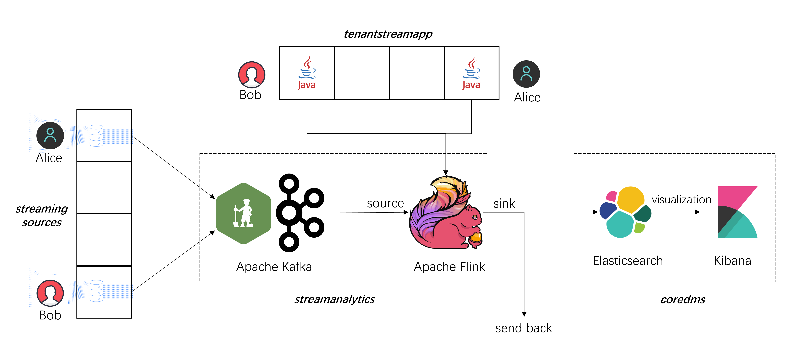
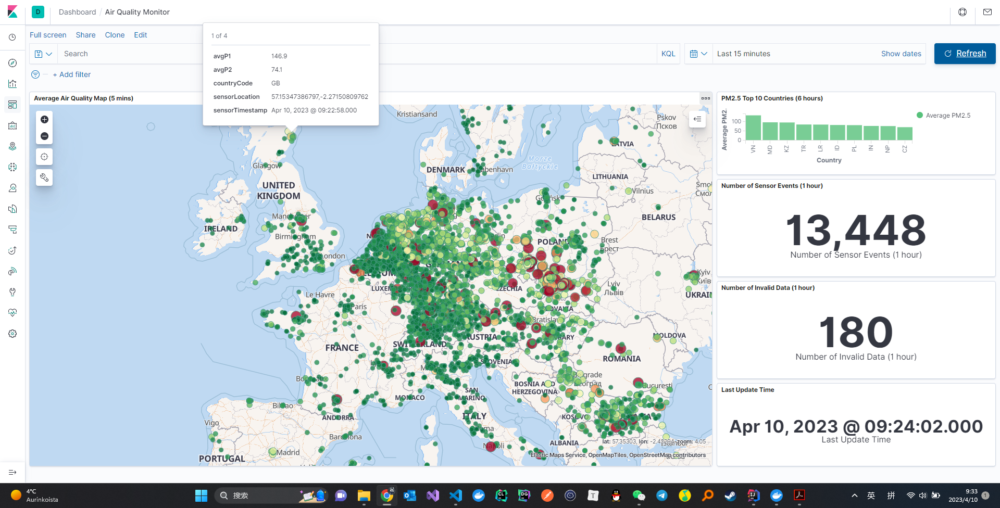

# CS-E4640 Big Data Platform Assignments

This repository contains all assignments for [CS-E4640 Big Data Platform Spring 2023](https://version.aalto.fi/gitlab/bigdataplatforms/cs-e4640/-/blob/master/schedule.md) with my solutions.

**Please DO NOT copy the solutions or share them with others when doing your assignments!**

## Assignment 1 - Building Your Big Data Platforms

## Assignment 2 - Working on Data Ingestion Pipelines

## Assignment 3 - Stream and Batch Processing

