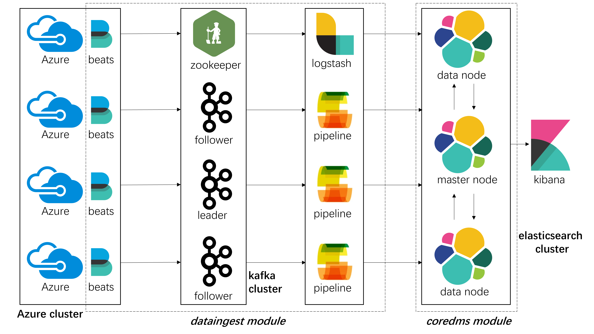

# Assignment 1  100480038

This is the first assignment for [CS-E4640 Big Data Platform Spring 2023](https://version.aalto.fi/gitlab/bigdataplatforms/cs-e4640/-/blob/master/schedule.md).

The assignment structure is below:
```bash
├─code
│  ├─coredms # docker-compose file for coredms module
│  └─dataingest # docker-compose file for dataingest module
│      ├─filebeat # filebeats config
│      └─logstash # filebeats config
│          ├─config
│          └─logstash-pipelines
├─data # small testing data which filebeats listens to
│  └─test 
├─logs
└─reports
    └─images
```

To deploy the assignment, follow the instructions in `reports/Assignment-1-Deployment.md`.
To view the assignment questions and my answers, go to `reports/Assignment-1-Report.md`.

## Architecture



Above is a high level view of my big data platform design. The Azure cluster sends traces to the `dataingest` module, where traces are collected, queued, and transformed into desired format. Then, the `dataingest` module stores formatted traces into the `coredms` module.

The `dataingest` module consists of three major platform components: Filebeats running on Azure servers, Apache Kafka cluster, and Logstash. Filebeats are responsible for listening to trace files on Azure servers and sending traces to the Kafka cluster. The Kafka cluster queues all the incoming traces and sends them to Logstash. Logstash consists of multiple user-defined pipelines for processing and transforming traces into correct format.

The `coredms` module is in fact an Elasticsearch cluster. All the trace data is stored here for further search or analysis. Kibana is a good tool for data visualization and analysis. 
