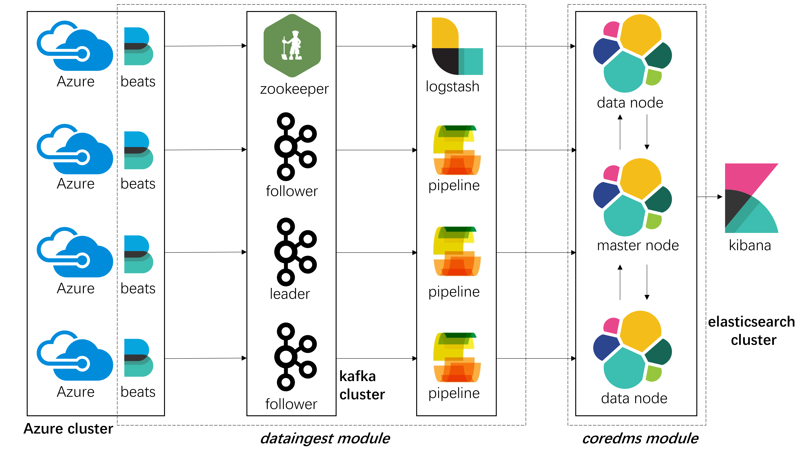

# First Assignment - Building Your Big Data Platforms

## Part 1 - Design

> 1. Explain your choice of the application domain and corresponding types of data to be supported and technologies for mysimbdp-coredms. Explain under which situations/assumptions, your platform serves for big data workload.

**Log/Trace Analysis** is my choice of the application domain. The `coredms` is able to support any type of log/trace file outputed by machines or applications. Key technologies used in my design include Elasticsearch, Kibana, Logttash, Filebeats, and Apache Kafka.

Here are some common situations where we perform log/trace analysis on the big data platform.
1. Identify and fix issues and bugs from the log/trace files.
2. Monitor the performace of the infrastructure and services and identify potential bottlenecks.
3. Detect suspicious behaviours and identify potential security vulnerabilities.
4. Identify the interaction between users and applications, which can be used to improve user experience.
5. Retain logs and traces for a specified period of time for compliance reasons.

> 2. Design and explain the interactions among main platform components in your architecture of mysimbdp. Explain which would be the third parties (services/infrastructures) that you do not develop for your platform.



Above is a high level view of my big data platform design. The Azure cluster sends traces to the `dataingest` module, where traces are collected, queued, and transformed into desired format. Then, the `dataingest` module stores formatted traces into the `coredms` module.

The `dataingest` module consists of three major platform components: Filebeats running on Azure servers, Apache Kafka cluster, and Logstash. Filebeats are responsible for listening to trace files on Azure servers and sending traces to the Kafka cluster. The Kafka cluster queues all the incoming traces and sends them to Logstash. Logstash consists of multiple user-defined pipelines for processing and transforming traces into correct format.

The `coredms` module is in fact an Elasticsearch cluster. All the trace data is stored here for further search or analysis. Kibana is a good tool for data visualization and analysis.

Among all the components, the Azure machines, and Kibana are not considered as a part of my big data platform. For convenience, in this assignment, I just assume that all the data flows occur on my local machine.

> 3. Explain a configuration of a cluster of nodes for mysimbdp-coredms so that you prevent a singlepoint-of-failure problem for mysimbdp-coredms for your tenants.

In `code/coredms/docker-compose.yml`, three elasticsearch nodes `es01`, `es02`, and `es03` are launched. They can discover each other by `discovery.seed_hosts` attribute. After an election, one of the nodes will become the master node. The master node is responsible for lightweight cluster-wide actions such as creating or deleting an index, tracking which nodes are part of the cluster, and deciding which shards to allocate to which nodes. If one of the nodes is down, the left two nodes will elect a new master which prevents a singlepoint-of-failure problem.

> 4. You decide a pre-defined level of data replication for your tenants/customers. Explain the level of replication in your design, how many nodes are needed in the deployment of mysimbdp-coredms for your choice so that this component can work property.

Normally, we have two replications to ensure the data availability. The replication cannot be stored on the node where the original data stays on. Therefore, we need three nodes at least. For index `vmtable`, I set the number of shards and replicas as following:
```json
"settings": {
    "index": {
        "number_of_shards": 5,
        "number_of_replicas": 2
    }
}
```
This configuration makes sure that all the data is splitted into five shards and each shard has two replications. Then, those 5 primary shards and 10 replicated shards are distributed across 3 elasticsearch nodes automatically.

Now, let's have a double check whether all the primary shards are successfully allocated and whether the replicated shards are not stored on the same node where the corresponding primary shards stay. With the help of Kibana stack monitoring:


we can conclude that the cluster is healthy and everythings works well as expected.

> 5. Explain how would you scale mysimbdp to allow many tenants using mysimbdp-dataingest to push data into mysimbdp.

From a high level of view, there are two types of scaling methods: vertical scaling horizontal scaling.

For vertical scaling:
1. Increase the memory of servers.
2. Increase the disk size of servers.
3. Improve the I/O performance of servers.

For horizontal scaling:
1. Increase the number of nodes in the cluster.
2. Increase the number of clusters across different regions.
3. Increase the number of data shards.


## Part 2 - Implementation

> 1. Design, implement and explain one example of the data schema/structure for a tenant whose data will be stored into mysimbdp-coredms.

The data to be stored into `coredms` is one type of traces from Azure workload 2019: VM information table (`vmtable`), which is a .csv file (783MB). The fields of each line in `vmtable` are defined as:

| field_number | content | format |
|--------------|---------|--------|
| 1 | vm id | STRING_HASH |
| 2 | subscription id | STRING_HASH |
| 3 | deployment id | STRING_HASH |
| 4 | timestamp vm created | INTEGER |
| 5 | timestamp vm deleted | INTEGER |
| 6 | max cpu | DOUBLE |
| 7 | avg cpu | DOUBLE |
| 8 | p95 max cpu | DOUBLE |
| 9 | vm category | STRING |
| 10 | vm virtual core count bucket | STRING |
| 11 | vm memory (gb) bucket | STTRING |

A sample line from `vmtable` (`data/test/test_vmtable.csv`) is shown below:
```
YrR8gPtBmfNaOdnNEW5If1SdTqQgGQHEnLHGPjySt53bKWsIlS26Phl9Uf5VHiso,9LrdYRcUfGbmL2fFfLR/JUg2OTkjGRe3iluwIhDRPnPDPaeBoI++cGPft6H/3QjV,GEyIElfPSFupze8T+T1niQMepeqG88VpLNuxUMyIDbz8VFbedMPl9qpkESVGcWPTuPZ07eSPnNjg3rQXZFgdkg==,1133100,1133700,0.30436761313316585,0.22055331663398622,0.30436761313316585,Unknown,4,32
```


> 2. Given the data schema/structure of the tenant (Part 2, Point 1), design a strategy for data partitioning/sharding, explain the goal of the strategy (performance, data regulation and/or what), and explain your implementation for data partitioning/sharding together with your design for replication in Part 1, Point 4, in mysimbdp-coredms

My sharding strategy is the default strategy of Elasticsearch. The shard number of a document is computed with the following formula:
```
shard = hash(routing) % number_of_primary_shards
```
`routing` is the key for sharding. By default, `routing` is the `_id` of a document, which is randomly generated.

Although we could customize the sharding key, I think `_id` is already a perfect choice. Our main goal for sharding is to achieve better scalability and performance. If we only have one shard, the size of that shard will become larger and larger over time. Horizontal scaling will not help in this situation because we have too much data in the same shard. An effective way is to split data into multiple approximately equal size of shards and scale them horizontally, which leads to approximately equal load balance for each node. The randomly generated `_id` as the key is surely enough for this scenario.

My implementation for data sharding together with my design for replication is well explained in Part 1, Point 4. With the help of Kibana stack monitoring, it's easy to see which shard a document is located in.

> 3. Assume that you are the tenant, write a mysimbdp-dataingest that takes data from your selected sources and stores the data into mysimbdp-coredms. Explain what would be the atomic data element/unit to be stored. Explain possible consistency options for writing data in your mysimdbpdataingest

The task is to store traces into `coredms`, which can be broken down into a few steps: collect, transform, and store.

First of all, we need to collect traces produced on each Azure servers. Filebeats is a perfect tool for detecting and collecting specified files on the machine. The key configuration for Filebeats is below:

```yml
filebeat.inputs:
- type: filestream
  id: vmtable
  enabled: true
  paths:
    - /var/log/*.csv

output.kafka:
  hosts: ["kafka01:9092"]
  topic: "filebeat"
  codec.json:
    pretty: false
```

The config tells Filebeats to send all .csv files in `/var/log/` to the topic `filebeat` of Apache Kafka hosted on `kafka01:9092`.

The second step is to transform traces into correct format. Logstash is a powerful tool for data ingestion and transformation integrated with Elasticsearch. However, transforming takes time. If Filebeats on different servers are sending extensive traces to Logstash, serious data congestion may happen. An effective solution is to place a broker, such as Apache Kafka, between Filebeats and Logstash. Then, Filebeats becomes producers and Logstash becomes consumers. The key configuration for Logstash is below:
```ruby
input {
  kafka {
    bootstrap_servers => "kafka01:9092"
    topics => ["filebeat"]
    codec => json
  }
}

filter {
  csv {
    separator => ","
    columns => ["vm_id","subscription_id","deployment_id","timestamp_vm_created","timestamp_vm_deleted","max_cpu", "average_cpu" ,"p96_max_cpu","vm_category","vm_virtual_core_count_bucket","vm_memory_bucket"]
  }
  mutate {
    convert => {
      "timestamp_vm_created" => "integer"
      "timestamp_vm_deleted" => "integer"
      "max_cpu" => "float"
      "average_cpu" => "float"
      "p96_max_cpu" => "float"
      "vm_virtual_core_count_bucket" => "integer"
      "vm_memory_bucket" => "integer"
    }
    remove_field => [ "message", "agent", "host", "input", "event", "log", "ecs", "tags", "@version" ]
  }
}

output {
  elasticsearch {
    hosts => ["http://es01:9200"]
    index => "vmtable"
  }
}
```

The config tells Logstash to consume data from the topic `filebeat` of Apache Kafka hosted on `kafka01:9092`. Then, each line of the .csv file is parsed into a correctly-formatted JSON object (**atomic data element to be stored**), which later is stored into the index `vmtable` of Elasticsearch hosted on `http://es01:9200`.

The last step is to store trace into Elasticsearch. Before running the `dataingest`, we'd better define the mapping for the index `vmtable` on Elasticsearch:
```json
PUT /vmtable
{
  "settings": {
    "index": {
      "number_of_shards": 5,
      "number_of_replicas": 2
    }
  },
  "mappings": {
    "properties": {
      "average_cpu": {
        "type": "double",
        "index":false
      },
      "deployment_id": {
        "type": "keyword"
      },
      "max_cpu": {
        "type": "double",
        "index":false
      },
      "p96_max_cpu": {
        "type": "double",
        "index":false
      },
      "subscription_id": {
        "type": "keyword"
      },
      "timestamp_vm_created": {
        "type": "integer",
        "index":false
      },
      "timestamp_vm_deleted": {
        "type": "integer",
        "index":false
      },
      "vm_category": {
        "type": "keyword"
      },
      "vm_id": {
        "type": "keyword"
      },
      "vm_memory_bucket": {
        "type": "integer"
      },
      "vm_virtual_core_count_bucket": {
        "type": "integer"
      },
      "@timestamp": {
        "type": "date"
      }
    }
  }
}
```

At last, the incoming data from Logstash will be correctly stored into the index `vmtable` on Elasticsearch.

Here are some possible options for ensuring data consistency in `dataingest`.

Apache Kafka has already provided an eventually-consistent model.

For Logstash:
1. Persistent queue: It allows events to be stored safely in case of network or hardware failures. It has already been enabled in my `dataingest`.
2. Transactional writes: When using output plugins that support it, Logstash can perform transactional writes to ensure that either all events are written or none of them are.

> 4. Given your deployment environment, measure and show the performance (e.g., response time, throughputs, and failure) of the tests for 1,5, 10, .., n of concurrent mysimbdp-dataingest writing data into mysimbdp-coredms with different speeds/velocities together with the change of the number of nodes of mysimbdp-coredms. Indicate any performance differences due to the choice of consistency options.

Test setting: write 500000 trace lines through `dataingest` to `coredms`. All the monitoring data is retrieved from Kibana Stack Monitoring panel.

Test1: one concurrent write to three-node Elasticsearch cluster


Test2: five concurrent writes to three-node Elasticsearch cluster


Test3: ten concurrent writes to three-node Elasticsearch cluster


Test4: ten concurrent writes to single-node Elasticsearch cluster


Test5: ten concurrent writes to three-node Elasticsearch cluster (Logstash persistant queue disabled)


All the data is successfully stored into `coredms` in all tests, which can be proved by showing the document count of the index `vmtable`:
```json
GET /vmtable/_count

{
  "count": 500000,
  "_shards": {
    "total": 5,
    "successful": 5,
    "skipped": 0,
    "failed": 0
  }
}
```


> 5. Observing the performance and failure problems when you push a lot of data into mysimbdpcoredms (you do not need to worry about duplicated data in mysimbdp), propose the change of your deployment to avoid such problems (or explain why you do not have any problem with your deployment)

Based on the test results, we can conclude that:
1. There is no serious performance problems because the latency, CPU usage, request rate, throughput look fine.
2. There is no failure problem because all the data is successfully stored into `coredms`.

The reasons why no such problems occur may be attributed to the following aspects.

1. Storing one line of traces into Elasticsearch do not take much time because this scenario does not require text searching. If the Elasticsearch is used to support text searching, it has to analyze the text and build the inverse index for each word of that text, which is time-consuming. Additionally, Elasticsearch is one type of NoSQL database, which doesn't perform strict schema or constraint check during insertion.
2. Elasticsearch provides built-in supports for clustering. Routing, sharding, replication, election are handled transparently and efficiently.
3. Logstash may be a bottleneck. However, in this scenario, Loagstash only does some simple work like type conversion which is not time-consuming. More complicated work like adding new fields may take more time.
4. Kafka serves as a buffer between Filebeats and Logstash. Even though there are multiple incoming concurrent writes, Kafka will queue them efficiently. Thus, Logstash is able to consume data at a proper rate.

## Part 3 Extension

> 1. Using your mysimdbp-coredms, a single tenant can create many different databases/datasets. Assume that you want to support the tenant to manage metadata about the databases/datasets, what types of metadata you would like to support? Can you provide one example of using the metadata to find a dataset?

Some key metadata about databases:
1. Owner identifier
2. Database engine type and version
3. Storage type (eg. I/O optimized)
4. Database identifier(eg. name)
5. Network address
6. Credentials (eg. password, key)
7. Allocated storage size
8. Access control lists
9. Encryption settings
10. Backup settings
11. Create time

One example could be that after a user log in our big data platform, he/she will see a list of databases created by himself/herself. After navigating into database detail page, he/she will get necessary information like network address to access the database.

> 2. Assume that each of your tenants/users will need a dedicated mysimbdp-coredms. Design the data schema of service information for mysimbdp-coredms that can be published into an existing registry (like ZooKeeper, consul or etcd) so that you can find information about which mysimbdp-coredms is for which tenants/users.

This requirement is pretty much similar to the above question. One simple example of data schema could be:
```json
{
  "tenant_id": "string",
  "database_name": "string",
  "database_uri": "string",
  "created_at": "datetime",
}
```

In this schema, we have the following fields:
1. `tenant_id`: A unique identifier for the tenant associated with the database.
2. `database_name`: The name of the database.
3. `database_uri`: The URI or connection string for the database.
4. `created_at`: The date and time when the database was created.

> 3. Explain how you would change the implementation of mysimbdp-dataingest (in Part 2) to integrate a service discovery feature (no implementation is required)

I would like to add a job queue to `dataingest`. The tenant need to create a data ingestion job which is stored in that queue. The job contains the following information:
1. Authentication and authorization information
2. Task name
3. Source URI (tenant's machines)
4. Destination URI (tenant-dedicated database)
5. Pipeline configurations for Logstash
6. Resources allocated for Kafka and Logstash (eg. node number)
7. Scheduled time

After a job is pushed into the queue, `dataingest` will process the job and allocate necessary resources to execute the job. The tenant will be notified later whether the job is successful or failed.

> 4. Assume that now only mysimbdp-daas can read and write data into mysimbdp-coredms, how would you change your mysimbdp-dataingest (in Part 2) to work with mysimbdp-daas?

Tenants send read requests to `daas` and `daas` reads data from `coredms`.

Tenants send write requests to `daas` and `daas` sends data to `dataingest`. After everything is correctly processed, the data is sent back to `daas` and `daas` sends data to `coredms`. Or, tenants send write requests to `daas` and `daas` directly stores data to `coredms`.

> 5. Assume that you have both mysimbdp-daas and mysimbdp-dataingest available for tenants/users write the data into mysimbdp-coredms. Explain and provide pros and cons of deployment examples suggesting when a tenant/user should use mysimbdp-daas and mysimbdp-dataingest.

Write the data using `daas`:
* Pros: simple, convenient
* Cons: unable to perform complicated transformation tasks, hard to scale

Write the data using `dataingest`:
* Pros: Able to perform complicated transformation tasks, easy to scale
* Cons: complicated, need more resources, consistency problems

All in all, if you are required to store large amount of data into `coredms` or need to perform complicated transformation tasks, you should consider to use `dataingest`. In contrast, `daas` is more suitable for transactional data processing.