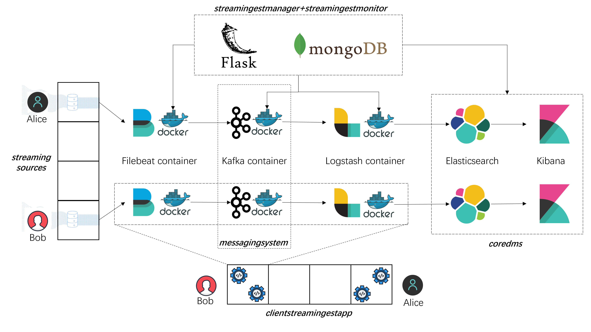

# Assignment 2  100480038

This is the second assignment for [CS-E4640 Big Data Platform Spring 2023](https://version.aalto.fi/gitlab/bigdataplatforms/cs-e4640/-/blob/master/schedule.md).

The assignment structure is below:

```bash
├─code
│  ├─batchingestmanager
│  │  └─app
│  │      ├─filebeat
│  │      ├─ingestion
│  │      ├─logstash
│  │      ├─profile
│  ├─client-staging-input-directory
│  ├─clientbatchingestapp
│  ├─clientstreamingestapp
│  ├─coredms
│  └─streamingestmanager
│      └─app
│          ├─filebeat
│          ├─ingestion
│          ├─kafka
│          ├─logstash
│          ├─profile
├─data
├─logs
└─reports
    └─images
```

To deploy the assignment, follow the instructions in `reports/Assignment-2-Deployment.md`.
To view the assignment questions and my answers, go to `reports/Assignment-2-Report.md`.
**It is highly recommended to have a big picture of the architecture of my design before reading the report and deployment instructions.**

## Batch Ingestion Architecture


Above is a high level view of my big data platform design for batch data ingestion. `client-staging-input-directory` is where clients input their data to be ingested. `clientbatchingestapp` stores clients' configs of Filebeat and Logstash, which later `batchingestmanager` can use to start docker containers. `batchingestmanager` is a backend service with MongoDB, which is responsible for creating, monitoring and destroying data ingestion jobs, as well as running `clientbatchingestapp`. `coredms` consists of Elasticsearch and Kibana for data storage and visualization.

Here are complete steps to execute an ingestion job:
1. The client creates his/her profile at `batchingestmanager`. The platform will pose some constrainsts on the client's jobs based on the profile.
2. The client defines the ingestion job specification, such as data format, data wrangling and data schema. Then,the client creates the job at `batchingestmanager`.
3. A dedicated folder at `client-staging-input-directory` is assigned to the client. The client puts all the data to be ingested into the above folder.
4. The client asks `batchingestmanager` to start the job. `batchingestmanager` retrieves the job specification and generates config files and docker-compose files into a dedicated folder at `clientbatchingestapp`.
5. `batchingestmanager` starts Filebeat and Logstash containers based on the configuration from `clientbatchingestapp`.
6. `job_monitor` background service in `batchingestmanager` monitors and records the status and metrics of Filebeat container, Logstash container, and Elasticsearch.
7. Logs generated by Filebeat and Logstash are stored into dedicated folders in `clientbatchingestapp`.
8. `job_monitor` will inform `batchingestmanager` to destroy the Filebeat and Logstash containers after all the data has been stored into Elasticsearch. Now, the job is done.
9. The client can gather all neccessary information either from `batchingestmanager` or logs.


## Stream Ingestion Architecture



Stream Ingestion Architecture is almost the same as the batch one. The only difference could be the additional `messagingsystem` which consists of a Zookeeper and Kafka container.