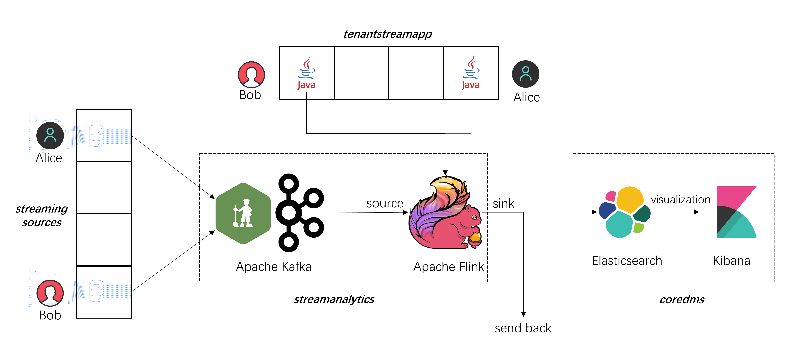
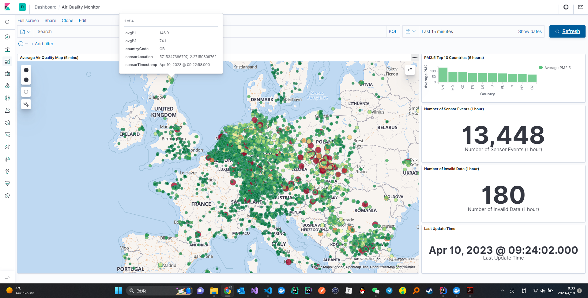

# Assignment 3  100480038

This is the third assignment (the last one!) for [CS-E4640 Big Data Platform Spring 2023](https://version.aalto.fi/gitlab/bigdataplatforms/cs-e4640/-/blob/master/schedule.md).

The assignment structure is below:
```
├─code
│  ├─coredms  // Elasticsearch + Kibana
│  ├─streamanalytics  // Kafka + Flink
│  ├─tenantdatasource  // Applications for sending data
│  └─tenantstreamapp  // Applications for streaming analytics
├─data
├─logs
└─reports
```

To deploy the assignment, follow the instructions in `reports/Assignment-3-Deployment.md`.
To view the assignment questions and my answers, go to `reports/Assignment-3-Report.md`.


## Architecture



## Visualization

