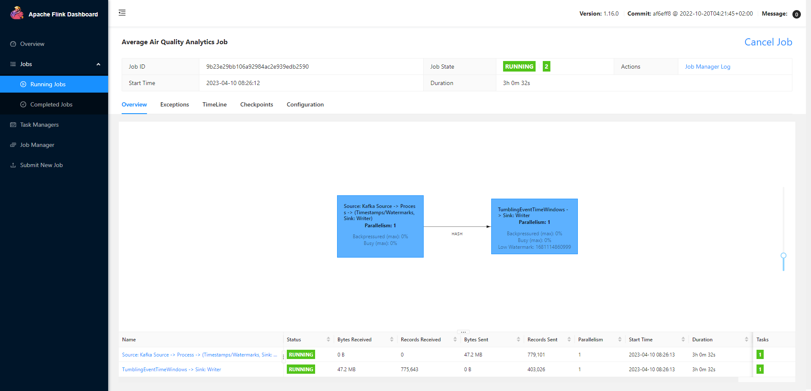
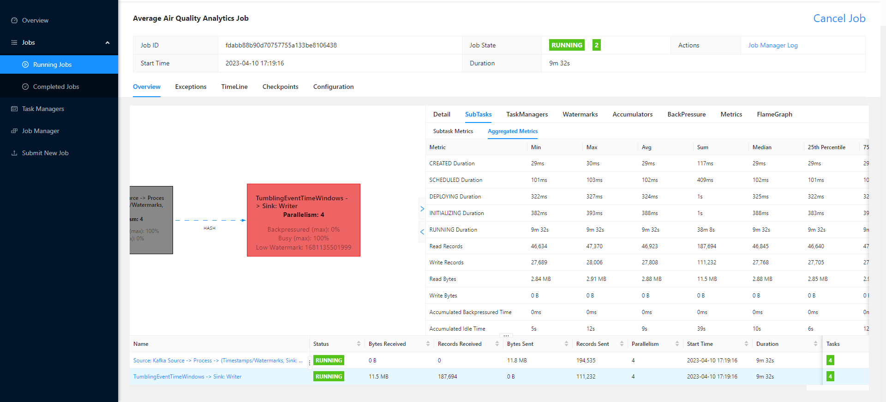
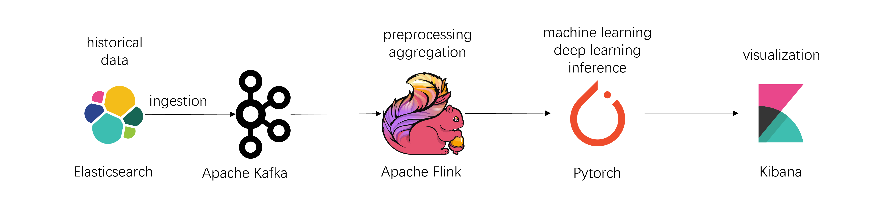

# Third Assignment - Stream and Batch Processing

## Part 1 - Design for streaming analytics

> 1. As a tenant, select a dataset suitable for streaming data analytics as a running scenario. Explain the dataset and why the dataset is suitable for streaming data analytics in your scenario. As a tenant, present at least two different analytics in the interest of the tenant: (i) a streaming analytics (tenantstreamapp) which analyzes streaming data from the tenant and (ii) a batch analytics, using the workflow model, which analyzes historical results outputted by the streaming analytics. The explanation should be at a high level to allow us to understand the data and possible analytics so that, later on, you can implement and use them in answering other questions.

My chosen dataset: [Open data about air quality monitoring from Germany](https://github.com/opendata-stuttgart/meta/wiki/EN-APIs). It is perfect for streaming data analytics because it provides near real-time APIs for requesting sensor data from all over the world with timestamps, latitudes and longitudes. In my case, I call the API "https://data.sensor.community/airrohr/v1/filter/type=SDS011" to collect all measurements of the last 5 minutes for sensors with type "SDS011". The format of the sensor data is below:
```json
{
  "sensordatavalues": [
    {
      "value_type": "P1",
      "value": "9.18",
      "id": 33431522435
    },
    {
      "value_type": "P2",
      "value": "8.30",
      "id": 33431522436
    }
  ],
  "sampling_rate": null,
  "location": {
    "altitude": "69.3",
    "exact_location": 1,
    "longitude": "7.96392544366",
    "latitude": "51.64207990000",
    "indoor": 0,
    "country": "DE",
    "id": 50862
  },
  "timestamp": "2023-04-09 11:21:02",
  "sensor": {
    "sensor_type": {
      "manufacturer": "Nova Fitness",
      "id": 14,
      "name": "SDS011"
    },
    "pin": "1",
    "id": 64483
  },
  "id": 14883647050
}
```

The `P1` and `P2` values represent the PM2.5 and PM10 value. In simple words, the API gives us near real-time (only 5-min latency) air quality measurements in different locations all over the world.

My chosen streaming analytics job: To show the average PM2.5 and PM10 values within the last 5 minutes in different locations on the map, which provides a big picture of the air quality distribution around the world.

My chosen batch analytics job: Based on the historical average PM2.5 and PM10 values, identify trends and patterns in the data with the help of machine learning or deep learning, which provides insights about the air quality around the world.

> 2. The tenant will send data through a messaging system, which provides stream data sources. Discuss, explain and give examples for the following aspects for the streaming analytics: (i) should the streaming analytics handle keyed or non-keyed data streams for the tenant data, and (ii) which types of delivery guarantees should be suitable for the stream analytics and why.

A keyed data stream is a stream of records where each record has an associated key, and Flink can partition the stream based on these keys. Keyed streams are useful when you need to group records based on a specific attribute or perform stateful operations on the stream, such as aggregations or windowing. On the other hand, a non-keyed data stream is a stream of records that do not have a key, and Flink processes each record independently. Non-keyed streams are useful when you do not need to perform any stateful operations or group records by a specific attribute. Therefore, when deciding whether to use keyed or non-keyed data streams in Flink for streaming analytics, it is important to consider the requirements of the specific use case and the types of operations that need to be performed on the data. If the tenant data requires grouping or stateful operations, then a keyed data stream is likely the better choice. However, if the tenant data does not require any grouping or stateful operations, then a non-keyed data stream may be sufficient.

In my case, keyed stream is needed because we are supposed to group the sensor data by the location and then compute the average measurements in each location within a fixed time window.


The choice of delivery guarantees depends on the specific use case and requirements of the system. Generally, there are three types of delivery guarantees that are commonly used:

1. At-most-once delivery: In this model, each record is processed at most once. If a record is lost or fails to be processed, it is not retried. This model is suitable when the loss of a few records is acceptable and does not affect the overall accuracy of the processing.

2. At-least-once delivery: In this model, each record is processed at least once, and if a record fails to be processed, it is retried until it is successfully processed. This model is suitable when it is important to ensure that no data is lost.

3. Exactly-once delivery: In this model, each record is processed exactly once, and there is no duplication or loss of data. This model is suitable when it is critical to ensure that every record is processed correctly and reliably.

In my case, at-least-once delivery is the most suitable. Because we're computing the average measurements, duplicated delivery will not have effects on the results. We just need to make sure the event is successfully delivered. By default, Flink and Kafka both use at-least-once delivery model.


> 3. Given streaming data from the tenant (selected before). Explain the following issues: (i) which types of time should be associated with stream data sources for the analytics and be considered in stream processing (if the data sources have no timestamps associated with events, then what would be your solution), (ii) which types of windows should be developed for the analytics (if no window, then why), (iii) what could cause out-of-order data/records with your selected data in your running example, and (iv) will watermarks be needed or not, explain why. Explain these aspects and give examples.


(i) There are generally two types of time that are associated with stream data sources: Event time and Processing time. Event time is the time when an event occurred in the real world, and it's embedded in the data record itself. Event time is generally the most reliable and accurate representation of time in stream processing, as it reflects the actual order in which events occurred in the real world.
Processing time is the time when an event is processed by the stream processing engine, and it's typically the clock time of the machine processing the event. Processing time is generally the simplest and fastest way to process events, but it may not reflect the actual order in which events occurred in the real world.

In my case, event time is used because fortunately there's timestamp associated with each sensor data event. All the data will be processed based on its timestamp, which will output reliable and consistent results.

(ii) There are several types of windows that can be used in stream analytics. Time-based windows group events based on a fixed time interval, such as a sliding window of 10 seconds or a tumbling window of 1 minute. Count-based windows group events based on a fixed number of events, such as a window of 100 events. Session windows group events based on a gap in time between events, such as a window that contains all events within 5 minutes of each other.

In my case, I use tumbling window of 5 minutes. When the window fires, it triggers a function to compute the average air quality measurements within the window.


(iii) Out-of-order data/records can occur in stream processing due to network delays, data replication, or processing delays. For example, in my case, sensors are located in different places. Even though they may send the data at the same time, the data arrives out of order due to different distances.

(iv) Watermarks are typically used in stream processing to handle out-of-order records and ensure correct processing of event time data. In my case, watermarks would be needed to ensure that the stream processing engine correctly handles events that arrive out of order. More importantly, the event-time-based windows depend on watermark to decide when to fire.


> 4. List performance metrics which would be important for the streaming analytics for your tenant cases. For each metric, explain its definition, how to measure it in your analytics/platform and why it is important for the analytics of the tenant (for whom/component and for which purposes).

1. Latency: This is the time it takes for data to be processed and analyzed, and for results to be returned. In the case of air quality monitoring, low latency is crucial because timely detection of air pollution events can be critical for public health and safety. Flink provides a built-in mechanism to measure end-to-end latency, which is the time taken for data to travel from the source to the sink. This can be done using the LatencyTracker API or by enabling the latency-tracking feature in the Flink configuration. Another simpler way is to show the latest updated time (retrieved from the timestamp of the sensor data) in the analytics dashboard. The difference between current time and that time is the latency.

2. Throughput: This refers to the rate at which data can be processed and analyzed. For air quality monitoring, high throughput is important to ensure that all the incoming data from various sensors can be processed in real-time. Flink provides a variety of metrics related to throughput, such as the number of records processed per second, the number of bytes processed per second, and the number of records processed per parallel task. These metrics can be accessed using Flink's MetricRegistry and can be visualized using Flink's dashboard or other monitoring tools.

3. Robustness: The analytics model should be robust and able to handle noisy data, outliers, and missing values. In the context of air quality monitoring, data from sensors may be affected by various factors such as weather conditions and interference from other sources, so the model must be able to handle these issues. Flink provides built-in fault-tolerance mechanisms, such as checkpointing and stateful processing, to handle noisy data, outliers, and missing values. In my case, I use the side output feature to redirect invalid data to a dedicated datastream. Error rates can be easily computed.


4. Scalability: The system should be scalable to handle increasing amounts of data as more sensors are added to the network. This is particularly important for air quality monitoring in urban areas, where a large number of sensors may be required. Flink is designed to be highly scalable, and can handle large amounts of data by parallelizing tasks across multiple nodes in a cluster. The scalability of the system can be tested by increasing the number of parallel tasks and monitoring the throughput and latency metrics. In addition, the data sink (elasticsearch) is also scalable, which supports partitioning data into multiple nodes or clusters.


> 5. Provide a design of your architecture for the streaming analytics service in which you clarify: tenant
data sources, mysimbdp messaging system, mysimbdp streaming computing service, tenant streaming analytics app, mysimbdp-coredms, and other components, if needed. Explain your choices of technologies for implementing your design and reusability of existing assignment works. Note that the result from tenantstreamapp will be sent back to the tenant in near real-time and to be ingested into mysimbdp-coredms.


The architecture of my design is below:
1. Tenant data sources: tenant-provided applications as data sources.
2. Messaging system: Zookeeper and Apache Kafka, which receives data from data sources.
3. Streaming computing service: Apache Flink (task manager + job manager), which consumes data from Kafka, performs streaming analytics, and sends data to different data sinks.
4. Tenant streaming analytics app: tenant-provided applications of streaming analytics, which is implemented with Java and built into a JAR package. The application is then submitted to Apache Flink.
5. Coredms: Elasticsearch for data storage, Kibana for data visualization and analytics.


## Part 2 - Implementation of streaming analytics

> 1. As a tenant, implement a tenantstreamapp. For code design and implementation, explain (i) the structures/schemas of the input streaming data and the analytics output result in your implementation, the role/importance of such schemas and the reason to enforce them for input data and results, and (ii) the data serialization/deserialization, for the streaming analytics application (tenantstreamapp).

The schema of the input streaming data is in csv format. Here's one example:
```
2023-04-10 05:19:52,37.534,-122.308,US,0.82,0.47
```
The fields represent the sensor timestamp, latitude and longitude of the sensor, country code, PM2.5 and PM10 value. It is easy for Flink applications to parse such format by simply splitting the string by commas. Also, unlike JSON format, it does not have field names which can contribute to smaller transmission size.

The schema of the output streaming data is in JSON format. Here are two mapping definitions in Elasticsearch:
```json
PUT avg-geo-air-quality-stats
{
  "mappings": {
    "properties": {
      "sensorTimestamp": {
        "type": "date",
        "format": "epoch_millis"
      },
      "sensorLocation": {
        "type": "geo_point"
      },
      "countryCode": {
        "type": "keyword"
      },
      "avgP1": {
        "type": "double"
      },
      "avgP2": {
        "type": "double"
      }
    }
  }
}

PUT invalid-sensor-data
{
  "mappings": {
    "properties": {
      "sensorTimestamp": {
        "type": "date",
        "format": "epoch_millis"
      },
      "sensorData": {
        "type": "keyword"
      }
    }
  }
}

```
One example for a document in index `avg-geo-air-quality-stats` could be:
```json
{
    "sensorLocation" : "50.426,7.664",
    "countryCode" : "DE",
    "sensorTimestamp" : 1681104240000,
    "avgP2" : 5.6,
    "avgP1" : 10.9
}
```
The reason for such output format is that Elasticsearch index request is JSON-formatted.

The input streaming data from Kafka source is deserialized into string format by using `SimpleStringSchema()`:
```java
DataStreamSource<String> csvStream = env.fromSource(
    KafkaSource.<String>builder()
    .setBootstrapServers("kafka01:9092")
    .setTopics("air")
    .setGroupId("air-group")
    .setStartingOffsets(OffsetsInitializer.earliest())
    .setValueOnlyDeserializer(new SimpleStringSchema())
    .build(),
    WatermarkStrategy.noWatermarks(),
    "Kafka Source");
```

At last, the processed data is serialized into JSON format:
```java
Map<String, Object> json = new HashMap<>();
json.put("sensorTimestamp", avgGeoAirQualityStats.sensorTimestamp);
json.put("sensorLocation", String.join(",", avgGeoAirQualityStats.sensorLocation.f0, avgGeoAirQualityStats.sensorLocation.f1));
json.put("countryCode", avgGeoAirQualityStats.countryCode);
json.put("avgP1", avgGeoAirQualityStats.avgP1);
json.put("avgP2", avgGeoAirQualityStats.avgP2);
return Requests.indexRequest()
    .index("avg-geo-air-quality-stats")
    .source(json);
```


> 2. Explain the key logic of functions for processing events/records in tenantstreamapp in your implementation. Explain under which conditions/configurations and how the results are sent back to the tenant in a near real time manner and/or are stored into mysimbdp-coredms as the final sink.

Here are two object definitions for the input data and output data:
```java
public static class SensorEvent {
    public Long sensorTimestamp;
    public Tuple2<String, String> sensorLocation;
    public String countryCode;
    public Double P1;
    public Double P2;
}
public static class AvgGeoAirQualityStats {
    public Long sensorTimestamp;
    public Tuple2<String, String> sensorLocation;
    public String countryCode;
    public Double avgP1;
    public Double avgP2;
}
```

First, create a Datastream `csvStream` from Kafka source:
```java
DataStreamSource<String> csvStream = env.fromSource(
    KafkaSource.<String>builder()
    .setBootstrapServers("kafka01:9092")
    .setTopics("air")
    .setGroupId("air-group")
    .setStartingOffsets(OffsetsInitializer.earliest())
    .setValueOnlyDeserializer(new SimpleStringSchema())
    .build(),
    WatermarkStrategy.noWatermarks(),
    "Kafka Source");
```

Then, create two Datastreams `sensorEventStream` (if successfully parsed) and `invalidFormatStream` (data in wrong format) from `csvStream`:
```java
final OutputTag<Tuple2<Long, String>> errorTag = new OutputTag<Tuple2<Long, String>>("error-output"){};

SingleOutputStreamOperator<SensorEvent> sensorEventStream =
    csvStream
    .process(new ProcessFunction<String, SensorEvent>() {
      @Override
      public void processElement(String line, Context context, Collector<SensorEvent> collector) throws Exception {
        // Parse the CSV row and assign names to each field
        try {
          String[] fields = line.split(",");
          DateTimeFormatter formatter = DateTimeFormatter.ofPattern("yyyy-MM-dd HH:mm:ss");
          Long sensorTimestamp = LocalDateTime.parse(fields[0], formatter).toEpochSecond(ZoneOffset.UTC) * 1000L;
          Tuple2<String, String> sensorLocation = Tuple2.of(fields[1], fields[2]);
          String countryCode = fields[3];
          Double P1 = Double.parseDouble(fields[4]);
          Double P2 = Double.parseDouble(fields[5]);
          collector.collect(new SensorEvent(sensorTimestamp, sensorLocation, countryCode, P1, P2));
        }catch (Exception e){
          String[] fields = line.split(",");
          DateTimeFormatter formatter = DateTimeFormatter.ofPattern("yyyy-MM-dd HH:mm:ss");
          Long sensorTimestamp = LocalDateTime.parse(fields[0], formatter).toEpochSecond(ZoneOffset.UTC) * 1000L;
          context.output(errorTag, Tuple2.of(sensorTimestamp, line));
        }
      }
    });

DataStream<Tuple2<Long, String>> invalidFormatStream = sensorEventStream.getSideOutput(errorTag);
```

Next is the core part of the streaming analytics: 
1. Assign the timestamp field of the data as the event time because we're using event-time-based processing.
2. Use `forBoundedOutOfOrderness(Duration.ofMinutes(1))` as the watermark strategy. The `maxOutOfOrderness` is one minute for low latency.
3. Group the data by `sensorLocation` using `keyBy()`.
4. For each keyed stream, set a 5-minute tumbling window with 5-minute-allowed lateness.
5. Compute the average PM2.5 and PM10 value within the above time window.

```java
DataStream<AvgGeoAirQualityStats> avgGeoAirQualityStatsStream =
    sensorEventStream
    .assignTimestampsAndWatermarks(
        WatermarkStrategy
        .<SensorEvent>forBoundedOutOfOrderness(Duration.ofMinutes(1))
        .withTimestampAssigner(((sensorEvent, l) -> sensorEvent.sensorTimestamp))
        .withIdleness(Duration.ofSeconds(5))
    )
    .keyBy(new KeySelector<SensorEvent, Tuple2<String, String>>() {
      @Override 
      public Tuple2<String, String> getKey(SensorEvent event) throws Exception {
        return event.sensorLocation;
      }
    })
    .window(TumblingEventTimeWindows.of(Time.minutes(5)))
    .allowedLateness(Time.minutes(5))
    .apply(new AverageAggregateFunction());
```

At last, it is up to the tenant to decide where the output data should be sinked to (`coredms` or send back or both) in real time. Flink provides sink connectors for a variety of external systems, such as Apache Kafka, AWS Kinesis, Google Cloud Pub/Sub, and Elasticsearch. In my case, the output streaming data is sinked to the Elasticsearch (`coredms`):
```java
avgGeoAirQualityStatsStream.sinkTo(
    new Elasticsearch7SinkBuilder<AvgGeoAirQualityStats>()
        .setBulkFlushMaxActions(1) // Instructs the sink to emit after every element, otherwise they would be buffered
        .setHosts(new HttpHost("es01", 9200, "http"))
        .setEmitter(
            (element, context, indexer) ->
                indexer.add(createAvgGeoAirQualityStatsRequest(element)))
        .build());

// avgGeoAirQualityStatsStream.print();

invalidFormatStream.sinkTo(
    new Elasticsearch7SinkBuilder<Tuple2<Long, String>>()
        .setBulkFlushMaxActions(1) // Instructs the sink to emit after every element, otherwise they would be buffered
        .setHosts(new HttpHost("es01", 9200, "http"))
        .setEmitter(
            (element, context, indexer) ->
                indexer.add(createInvalidSensorDataRequest(element)))
        .build());
```
If tenants want to send the same processed data to other places in real time, they just need to add more sink connectors in their applications. Similar to sinks, if tenants want to receive data from other sources in real time, they just need to add more source connectors in their applications.


> 3. Explain a test environment for testing tenantstreamapp, including how you emulate streaming data, configuration of mysimbdp and other relevant parameters. Run tenantstreamapp and show the operation of the tenantstreamapp with your test environments. Discuss the analytics and its performance observations when you increase/vary the speed of streaming data.

`air.py` in `tenantdatasource` is used for collecting near real time sensor data from the API and sending data to Kafka. After running `air.py` and submitting the `air-quality-monitor` in `tenantstreamapp`, we can visualize the real time analytics with the help of Kibana dashboard. Here's the visualization after running the `tenantstreamapp` for about an hour:

As we can see from the figure, the latest air quality in different locations is shown on the map. We can also easily compute the latency, throughput, and error rate from the dashboard. The end to end latency is about 10 minutes because the requested data is generated 5 minute ago and we have a 5-minute tumbling window (the ideal latency should be exact 5 minute). The throughput is 13448 items per hour, which is highly related to the frequency of sensor data pushing and number of sensors. The error rate is about 180/13448=1.3% because some sensor data does not contain both PM2.5 and PM10 values.

You can modify `RATE_PER_SECOND` to change the speed of streaming data. After testing, there's no significant performance change found.

Here is the dashboard of Flink job manager. More metrics can be found here:


> 4. Present your tests and explain them for the situation in which wrong data is sent from or is within the data sources. Explain how you emulate wrong data for your tests. Report how your implementation deals with that (e.g., exceptions, failures, and decreasing performance). You should test with different error rates.

Wrong data is within the data sources. After observations, I find that some of the sensor data does not contain both PM2.5 and PM10 value. My implementation deals with wrong data by catching exceptions when parsing the input data. The data will be sent to `sensorEventStream` if successfully parsed. If there's something wrong parsing the data, it will be sent to `invalidFormatStream`, which utilizes the "side output" feature in Flink:
```java
final OutputTag<Tuple2<Long, String>> errorTag = new OutputTag<Tuple2<Long, String>>("error-output"){};

SingleOutputStreamOperator<SensorEvent> sensorEventStream =
    csvStream
    .process(new ProcessFunction<String, SensorEvent>() {
      @Override
      public void processElement(String line, Context context, Collector<SensorEvent> collector) throws Exception {
        // Parse the CSV row and assign names to each field
        try {
          String[] fields = line.split(",");
          DateTimeFormatter formatter = DateTimeFormatter.ofPattern("yyyy-MM-dd HH:mm:ss");
          Long sensorTimestamp = LocalDateTime.parse(fields[0], formatter).toEpochSecond(ZoneOffset.UTC) * 1000L;
          Tuple2<String, String> sensorLocation = Tuple2.of(fields[1], fields[2]);
          String countryCode = fields[3];
          Double P1 = Double.parseDouble(fields[4]);
          Double P2 = Double.parseDouble(fields[5]);
          collector.collect(new SensorEvent(sensorTimestamp, sensorLocation, countryCode, P1, P2));
        }catch (Exception e){
          String[] fields = line.split(",");
          DateTimeFormatter formatter = DateTimeFormatter.ofPattern("yyyy-MM-dd HH:mm:ss");
          Long sensorTimestamp = LocalDateTime.parse(fields[0], formatter).toEpochSecond(ZoneOffset.UTC) * 1000L;
          context.output(errorTag, Tuple2.of(sensorTimestamp, line));
        }
      }
    });

DataStream<Tuple2<Long, String>> invalidFormatStream = sensorEventStream.getSideOutput(errorTag);
```
All the wrong data will also be sinked to Elasticsearch for possible additional processing.

You can intentionally add any number of wrong data in `air.py` to change the error rate. After testing, there's no significant performance change with different error rates, perhaps because exception catching decreases speed and skipping analytics on wrong data increases speed.


> 5. Explain parallelism settings in your implementation (tenantstreamapp) and test with different (higher) degrees of parallelism for at least two instances of tenantstreamapp (e.g., using different subsets of the same dataset). Report the performance and issues you have observed in your testing environments. Is there any siutation in which a high value of the application parallelism degree could cause performance problems, given your limited   computing resources.

The parallelism of a task can be easily specified in Flink on different levels: operator level, environment level, and client level. For example, the average value computing processing is the most resource-comsuming and it is suitable to give more degress of parallelism for the group and window operator:
```java
DataStream<AvgGeoAirQualityStats> avgGeoAirQualityStatsStream =
    sensorEventStream
    .assignTimestampsAndWatermarks(
        WatermarkStrategy
        .<SensorEvent>forBoundedOutOfOrderness(Duration.ofMinutes(1))
        .withTimestampAssigner(((sensorEvent, l) -> sensorEvent.sensorTimestamp))
        .withIdleness(Duration.ofSeconds(5))
    )
    .keyBy(new KeySelector<SensorEvent, Tuple2<String, String>>() {
      @Override 
      public Tuple2<String, String> getKey(SensorEvent event) throws Exception {
        return event.sensorLocation;
      }
    })
    .window(TumblingEventTimeWindows.of(Time.minutes(5)))
    .allowedLateness(Time.minutes(5))
    .apply(new AverageAggregateFunction())
    .setParallelism(4);
```
`setParallelism()` function helps us easily set the degrees of parallelism for any operator. One simpler way is to set up the degrees of parallelism when submitting the tasks in Flink webUI. Here's one example of the application status with 4 paralleled instances:


One issue I found when setting the degrees of parallelism is that if one of the input partitions (kafka) does not carry events for a while, then the `WatermarkGenerator` also does not get any new information on which to base a watermark, which is called an idle source. This problems will cause the windows not evaluating values because the watermark is computed as the minimum over all the different parallel watermarks. To deal with this, `WatermarkStrategy` provides a convenience helper for this: the `withIdleness()` function, which ignores the idle source after a specified period of time. 

One potential issue with high degrees of parallelism is resource contention. If the underlying computing resources are limited, setting a high value for the application parallelism degree could cause performance problems. For example, if the number of available processing units is less than the number of parallel instances, the system may spend more time on context switching and thread synchronization, reducing the overall throughput of the application.


## Part 3 - Extension

> 1. Assume that you have an external RESTful (micro) service which accepts a batch of data (processed events/records) and performs an ML inference and returns the result. How would you connect such a service into your current platform and suggest the tenant to use it in the streaming analytics? Explain what the tenant must do in order to use such a service.

To connect an external RESTful service into my streaming analytics platform, we need to follow the below steps:

1. Define the input and output schema of the RESTful service, which will help in defining the input and output format of data that is expected by the service.

2. Create a operator in the streaming analytics platform that sends the batch of data to the RESTful service and receives the result. This operator can be created using the API provided by the platform.

3. Configure the operator with the endpoint and other required parameters of the RESTful service.

4. Integrate the custom operator into my streaming pipeline. This can be done by connecting the operator with the upstream and downstream operators that process and consume the data.

Once the custom operator is integrated into the streaming pipeline, the tenant can use it in the following way:

1. The tenant needs to provide the data that needs to be sent to the external service. This data should be in the format expected by the input schema of the RESTful service.

2. The tenant needs to configure the custom operator with the endpoint and other required parameters of the external service.

3. The tenant needs to connect the custom operator with the upstream operator that produces the data and the downstream operator that consumes the result. Then, the tenant needs to start the streaming pipeline.

The custom operator will send the batch of data to the external RESTful service, receive the result, and pass it downstream to the next operator in the pipeline. The tenant can then use this result for further processing or analysis.


> 2. Given the output of streaming analytics stored in mysimbdp-coredms for a long time. Explain a batch analytics (see also Part 1, question 1) that could be used to analyze such historical data for your scenario. Assume you have to design the analytics with the workflow model, draw the workflow of the batch analytics and explain how would you implement it?



According to part 1 question 1, the scenario is to use a batch analytics workflow to identify trends and patterns in the data based on the historical data of average air quality in different locations.The following is a possible workflow for the batch analytics:

1. Data ingestion: The first step is to extract the historical data from Elasticsearch and load it into the batch analytics pipeline. This can be done using a data ingestion tool like Apache Kafka.

2. Data preprocessing: The next step is to clean and preprocess the data to remove any outliers, missing values, or errors. This can be done using tools like Apache Spark or Flink.

3. Data aggregation: In this step, the historical data is aggregated to provide a summary of the average air quality in different locations over a longer period of time. This can be done using tools like Apache Flink.

4. Pattern identification: In this step, statistical and machine learning techniques can be applied to identify any patterns or trends in the data. This can be done using tools like Python scikit-learn or Pytorch.

5. Data visualization: The aggregated data is visualized to provide insights and trends over time. This can be done using tools like Kibana.

6. Predictive analytics: Finally, predictive analytics can be applied to the historical data to forecast the future air quality in different locations. This can be done using tools like Python scikit-learn or Pytorch.

To implement this workflow, the following steps can be taken:

1. Identify the tools and technologies required for each step of the workflow.

2. Design the workflow, specifying the inputs, outputs, and dependencies of each step.

3. Configure and deploy the required tools and technologies in a batch analytics environment.

4. Develop the code required for each step of the workflow.

5. Test and validate the workflow using sample data.

6. Execute the workflow on the historical data to generate insights and predictions.

7. Store the results in a suitable format for further analysis and reporting.


> 3. Assume that the streaming analytics detects a critical condition (e.g., a very high rate of alerts) that should trigger the execution of the above-mentioned batch analytics to analyze historical data. The result of the batch analytics will be shared into a cloud storage and a user within the tenant will receive the information about the result. Explain how you will use workflow technologies to coordinate these interactions and tasks (use a figure to explain your design).

We can use Apache Airflow to implement the workflow:

1. The streaming analytics system detects a critical condition and triggers a webhook to notify the Airflow system.
2. Airflow receives the webhook and starts a new DAG (Directed Acyclic Graph) instance.
3. The DAG instance contains tasks that will execute the batch analytics and share the result with the user.
4. The first task in the DAG downloads the necessary data from Elasticsearch and stores it in a temporary location accessible to the batch analytics tool.
5. The second task executes the batch analytics tool with the downloaded data as input, and stores the result in a cloud storage system (e.g. Amazon S3, Google Cloud Storage).
6. The final task sends a notification to the user containing a link to the result in the cloud storage system.

The workflow is performed inside Apache Airflow and explained clearly in tex, so the figure is omitted here.

> 4. Given your choice of technology for implementing your streaming analytics. Assume that a new schema of the input data has been developed and new input data follows the new schema (schema evolution), how would you make sure that the running tenantstreamapp does not handle a wrong schema? Assume the developer/owner of the tenantstreamapp should be aware of any new schema of the input data before deploying the tenantstreamapp, what could be a possible way that the developer/owner can detect the change of the schemas for the input data.

In Flink, to handle schema evolution, we can use the Flink Table API and its support for schema inference and evolution. The Table API provides a feature called schema auto-detection, which automatically infers the schema of the input data and adapts to changes in the schema of the input data at runtime. This means that if new input data follows a new schema, the Table API will automatically detect the schema change and adjust the processing accordingly.

To make sure that the running app does not handle a wrong schema, we can use the Table API to define a schema explicitly and validate that the input data conforms to the expected schema before processing. If the input data does not conform to the expected schema, you can reject it or handle it as an error.

To detect changes in the schema of the input data before deploying the app, the developer/owner can define a schema registry or a schema evolution plan that describes how the schema of the input data is expected to change over time. The schema registry can be used to store and manage different versions of the schema, and the schema evolution plan can be used to specify how to handle different versions of the schema. The developer/owner can then use tools to monitor the input data and compare it to the schema registry to detect any changes in the schema of the input data. If a change is detected, the developer/owner can update the app accordingly and deploy the new version with the updated schema.


> 5. Is it possible to achieve end-to-end exactly once delivery in your current tenantstreamapp design and implementation? If yes, explain why. If not, what could be conditions and changes to achieve end-to-end exactly once? If it is impossible to have end-to-end exactly once delivery in your view, explain why.

From my perspective, it is not possible to achieve end-to-end exactly once delivery in the current app design and implementation.

This is because the data is coming from an external source (sensors, Kafka) and is being processed by multiple stages in the application, including the Flink window functions and possibly the external microservice like ML inference. Each stage may have its own buffering and processing logic, and failures or retries may result in duplicate processing of some events.

To achieve end-to-end exactly once delivery, all stages in the data processing pipeline need to support exactly once semantics. This would require coordination and cooperation between the external data source, Flink stages, and the external microservice. The external data source would need to support some form of transactional ingestion, and the Flink application and external microservice would need to be able to participate in distributed transactions to ensure that each event is processed exactly once.

Alternatively, if end-to-end exactly once delivery is not possible or feasible, the application could be designed to support idempotent processing, where duplicate events are detected and discarded during processing. This could be achieved by assigning unique identifiers to each event and maintaining a record of processed events to detect duplicates.


